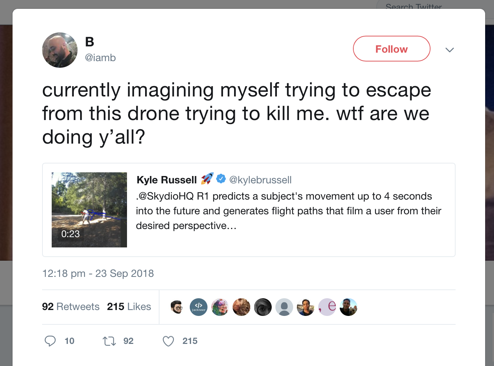

# Yet Another Introduction To AI

---

# Hi, I'm Nick

^ I’m a developer at thoughtbot. We’re a consultancy of about 90 people that
works with a broad range of clients, some small, some quite large (like who
I’ve been working with at the moment!). Some projects are highly design driven,
some are super technical.

^ We typically work in teams of 2-3, with at least a designer and a developer.
This is a sweet spot we've found from working on many different projects over
the years.

---

[.footer: https://robots.thoughtbot.com/recommending-blog-posts]

^ We’re mostly known for a mix of our blog, Giant Robots, and our open source
work. We've been building projects in Rails since the beginning, so we've
written and still maintain a bunch of those.

---

^ I maintain a few projects myself. One of those is `administrate` and I spend
a good amount of my non-client time on that.

---

# What do we mean when we talk about AI?

^ But I'm here to talk to you about AI. What do I mean by that?

---

[.footer: Photo by Steve Jurvetson. CC BY-SA 2.0, https://commons.wikimedia.org/w/index.php?curid=16607901]

^ There's the big and flashy, like self-driving cars. We've all heard about
those.

---

[.footer: Photo by LGEPR. Uploaded by NativeForeigner, CC BY 2.0, https://commons.wikimedia.org/w/index.php?curid=9579038]

^ A washing machine. Is this AI? I'll come back to this one.

---

^ And I'm sure we've seen recommendations, too.

^ Amazon is perhaps a little notorious for both great and terrible
recommendations. Has anyone bought something like a kettle, or microwave to
then have those _again_ recommended to them again? I know after buying one
kettle I totally want to be buying another!

---

## Machine Learning

^ When we talk about AI, we often really mean "machine learning". This
encompasses a collection of well-specified algorithms which allow a computer to
"think".

---

[.footer: https://twitter.com/daisyowl/status/841802094361235456]

^ And by "think", I mean detect patterns. Humans are pretty good at it, but we
struggle when taking in too much information and we start to get tired.

^ For much of the problems we're coming across as an industry, this is enough
to count at "thinking".

---

# A Brief Introduction to Machine Learning

^ The tools behind ML stretch from statistical methods, like the distance
calculations used in clustering, to probabilities as in bayesian classification
to artificial neurons in ANN. 

^ These latter ones are the most interesting. We call it deep learning when
there’s many layers of neurons, all feeding into each other.

^ We don’t know what they’re doing: sometimes the outcomes can be surprising.

^ A good proportion of the problem space here is finding the image or signal
processing problem in other data. This is what we see in the big and flashy
projects, like self-driving cars. They're really a collection of multiple, 
different problems.

---

# Data

^ That's all well and good, but what about data? All of the algorithms
mentioned above live or die in their usefulness in the data you train them on.

^ Much time and energy has been spent on building really interesting tools
…only to find that they're not quite behaving the way we might expect.

---

## The Case of the Cloud Detector

^ We've been doing this for a long time. Back in the 1980's, the Pentagon
wanted to explore ways in which to detect tanks in fields more accurately.

^ The researchers prepared a set of 200 photos, half of which had tanks hiding
behind trees and the other half with no tanks at all. They built a neural
network which seemingly was able to detect when there was tanks …and very 
accurately!

^ But, really they'd built a cloudy day detector. Of their input data set, all
of the photos _with_ tanks had been taken on a cloudy day and the NN was
optimising for the most significant feature: in this case, clouds.

---

## Rulers!?

^ A more recent example happened with some cancer researchers. A clinical
dermatologist was designing an algorithm to recognize skin cancer.

^ They also had a data set of valid and invalid examples. Unfortunately, they
really built a ruler detector. The largest tumors had been photographed with
rulers next to them.

---

## Under and over-fitting

^ These are both fundamentally cases of solving the wrong problem, but they
highlight some common flaws we can see with data sets.

* **Underfitting**: if our sample size is too small, we don't have enough
  information to accurately model real life
* **Overfitting**: if we have too much data and too complex a problem, we end
  up with a model too specific and inflexible

---

## Bias

^ Not all is well with the outcomes that could be had though.

^ A little while ago, Google released a sentiment analysis API based on web 
content.

---

[.footer: https://twitter.com/danluu/status/896176897675153409]

^ Turns out, the web is pretty terrible.

^ But there's a serious point here: the data we based our algorithms off will
be representative of the output we get from it.

---

# Slakka

^ Over the past few months we’ve been building a few ML projects internally.

^ One of these is Slakka: a Slack bot that tries to bridge information gaps.
Chat bots often just end up as a sub par way to interact with a service, so so
far, we’ve focused on informing when people won’t reply because they’re not in
today. 

^ The next plan is to augment what people say with other suggestions: for
example we tell each other we’re off sick by posting in Slack. If the bot knows
what you said, it can remind you to log that in our project tracking system,
Hub. 

^ There’s four gigs of text data from many years of Slack usage. We’re just now
trying to work through that and start to classify data to build us up an
example set. 

---

# New Tools

^ There's a bunch of new tools that I'm getting excited about.

^ We've been seeing Python be the most common ecosystem used for ML projects,
primarily through it's strong academic connection. But Scala and the JVM
showing up next in interest.

^ Slakka, our bot I mentioned, is Scala. On real-time problems, the JVM turns
out to be pretty fast and the functional style and actor model that Scala uses
is nice to work with.

^ Not just in bots like this, but real-time classification is super
interesting.

---

## Mobile

^ On mobile, we're seeing things like `MLKit` which is allowing the powerful
devices to do all sorts of classification work. Additionally, this is allowing
for the reuse and combination of existing models. TensorFlow, Keras and others
are supported.

^ Reuse and compression

^ In some ways, we're seeing a repeat of the mobile boom time after the iPhone
and App Store was released. We're getting a lot of "what if x but with ML?",
just as we were getting "what if x but on a phone!?" like we did then. Some
stuff has stuck …it turns out that Foursquare's check in model works really
well even though Yelp already existed. Much like taxis on a phone has made Uber
and Lyft successful.

---

# A cautionary tale

^ As I was putting this talk together, I realised that as cool as all of this
technology is, it's sometimes quite hard to be optimistic about our use of it.

^ We can do a lot of very exciting things with everything that I've covered.
But what we build does come with a certain amount of responsibility.

---

[.footer: https://twitter.com/iamb/status/1043942754554851328]

^ The same technology that gives us a selfie drone is also a hunting missile
and we're making that acceptable and, as I'd mentioned about bias, the internet
knows some pretty racist things.

---

# The Future

^ The thing about AI is that whilst we could think through most of the problem
spaces ourselves, we can't do all of it and our solutions cannot evolve. We're
solving the same problems we've always been able to solve, but now the machine
is writing those solutions for us.

^ Washing Machine!

^ e.g.: with our Slack bot, emoji use evolves. Who knows how we'll communicate
taking a sick day in a few years time? The AI will learn though.

---

# References

* [Fraser, Neil. “Neural Network Follies.” 1998.](https://neil.fraser.name/writing/tank/)
* [Shane, Janelle. "Neural Networks Explained." _Physics World._ 2018.](https://physicsworld.com/a/neural-networks-explained/)
