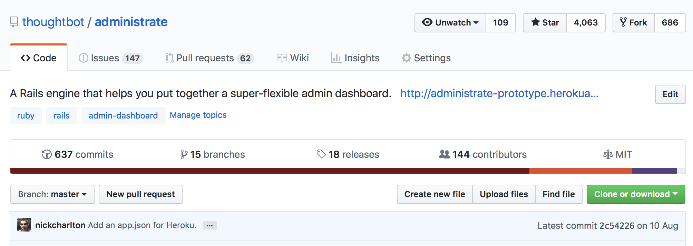
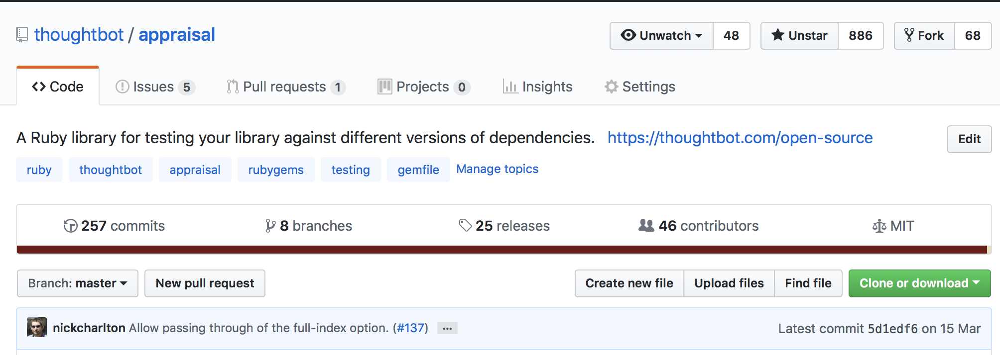
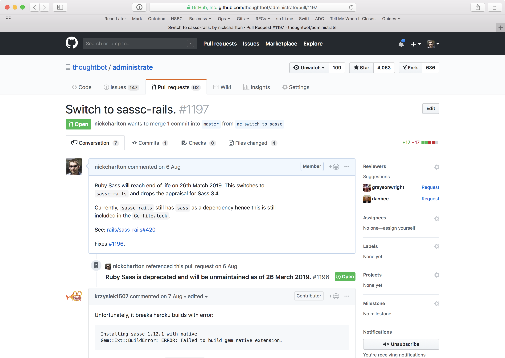
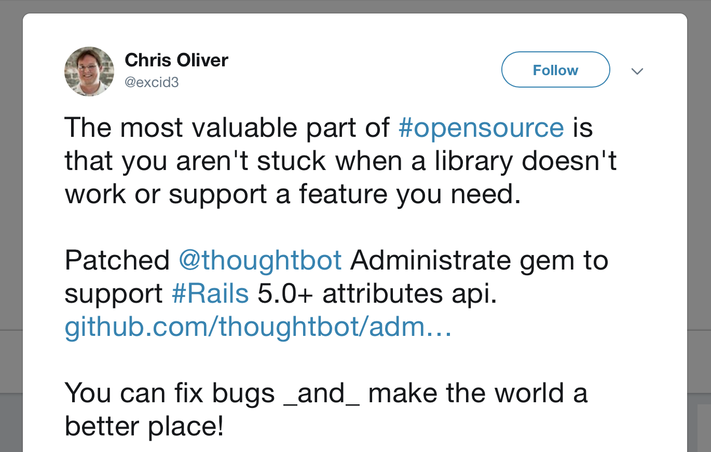
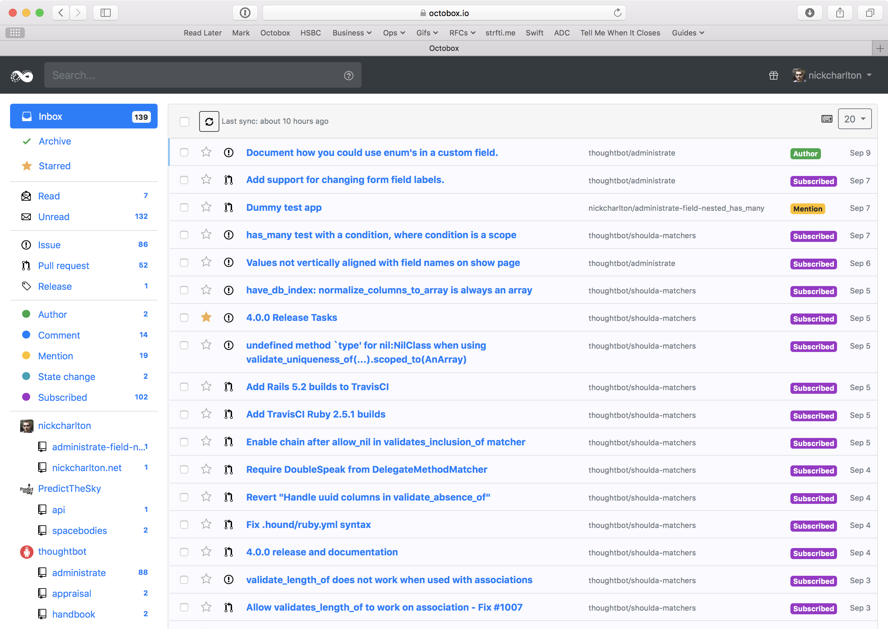
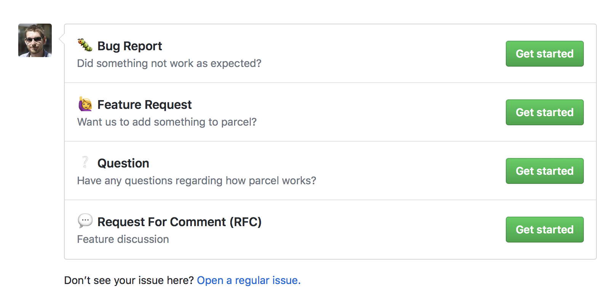
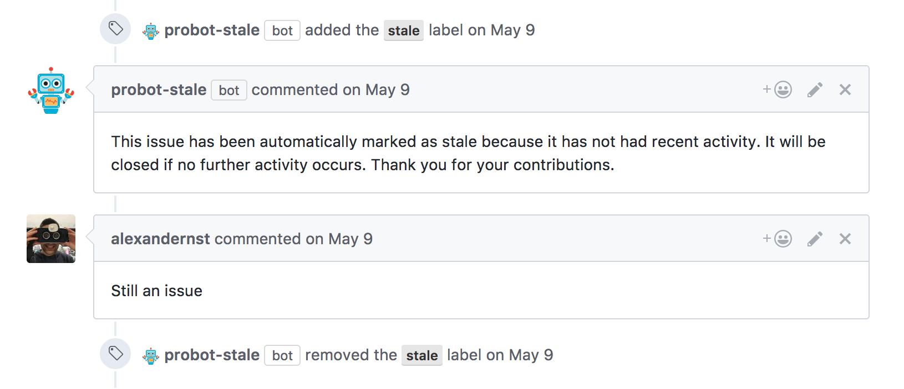
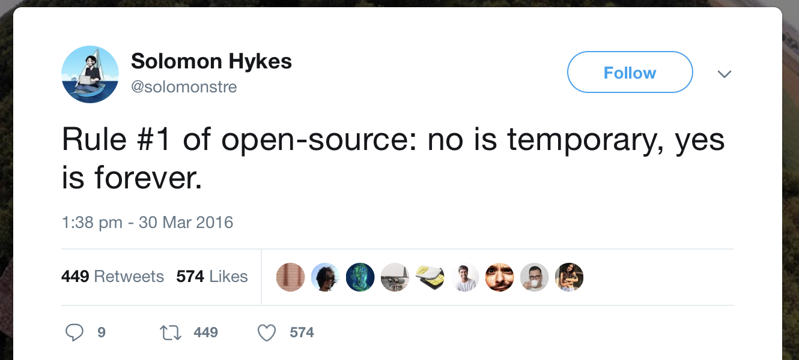
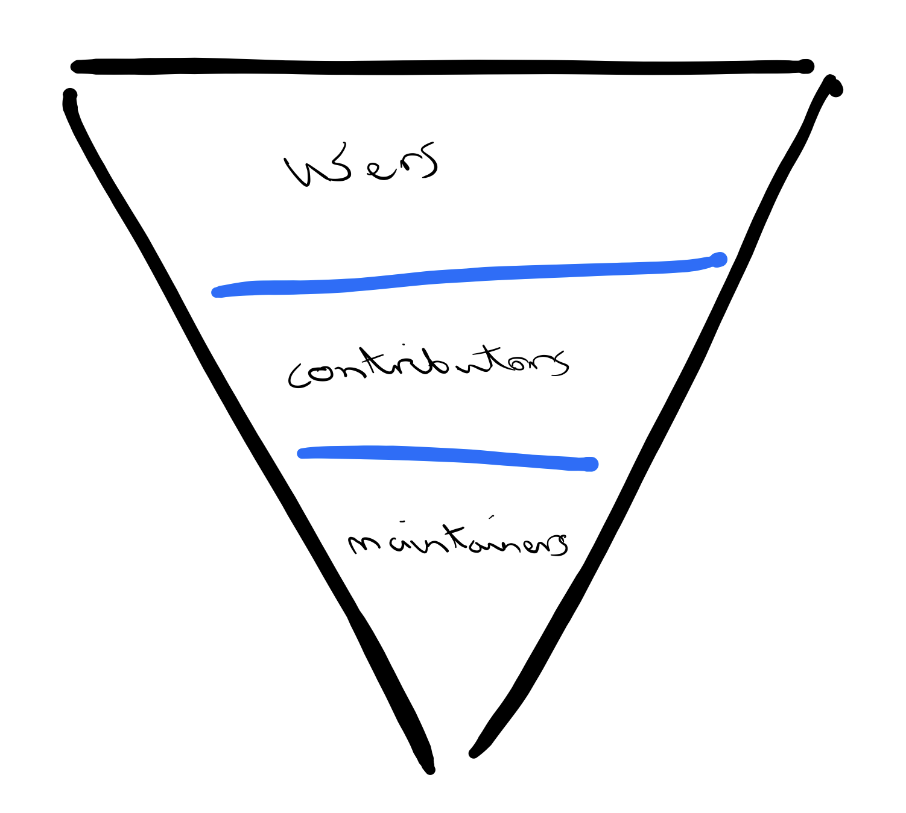

# Maintaining Open Source

## or how I learned to stop worrying and love dealing with grumpy people

---

# Hi, I'm Nick

^ I’m a developer at thoughtbot. We’re a consultancy that works with a
broad range of clients, some small, some quite large.

^ You might know thoughtbot from our blog or our open source work. We've done a 
lot in the Ruby community. For the past couple of years, I’ve taken over
maintaining a couple of those open source projects and that’s what I spend
nearly all of my non-client work time on.

^ I also went to Uni here.

---

## Investment Time

^ By “non-client time”, I mean investment days. As a consultancy, we work in 4 
day weeks. The remaining day, typically Fridays, in which to work on projects 
which invest in ourselves, the company or the community as a whole.

^ As a 15 year-old company, this hasn’t always been the case; back when we’d 
started a lot of our early open source efforts it was mostly between projects 
and in evenings or weekends. I’ll come back to this later on.

---



^ I maintain a few popular Ruby gems. `administrate`, which is a non-domain
specific language approach to building an admin interface in a Rails app. 

---



^ ...and `appraisal` which makes it easier to test against different
dependency versions in Ruby.

^ `administrate` is often used on internal Rails projects and we don’t really
know how it’s being used or by how much. But, I often see `appraisal` on other
open source projects I come across.

^ As a maintainer, I think I’m pretty bad at it, but somehow people keep using
all of them. If you opened an issue, or contributed a PR in the last few months
or so, I’ve likely still not seen it. It’s a bit like my email inbox…

---

# A Brief History of Open Source

^ But before we go into that, let’s talk about what I mean by “open source”.

^ Nearly all, if not actually _all_ software is built on a foundation of
freely available code that’s written and maintained by communities of
people all around the world.

^ 56%

---



^ When we think about “open source” now, we probably think of GitHub with
issues, pull requests and forking. But for a long time this wasn’t
the centre of everything. Projects have been built around mailing lists,
forums, blogs and just email.

---

```
From 13c6409b6977a681aae45d784c2e835b06701c1b Mon Sep 17 00:00:00 2001
From: Nick Charlton <nick@nickcharlton.net>
Date: Mon, 6 Aug 2018 19:16:01 +0100
Subject: [PATCH 1/5] Return a 404 when docs pages are not found. (#1177)

Safari, at least, always tries to load a `apple-touch-icon.png` which
`DocumentationController` tries to find and render as markdown. This
leads to the prototype app having a lot of odd errors.
---
 .../app/controllers/docs_controller.rb        | 27 +++++++++++++++----
  spec/features/documentation_spec.rb           |  6 +++++
   2 files changed, 28 insertions(+), 5 deletions(-)

   diff --git a/spec/example_app/app/controllers/docs_controller.rb 
   b/spec/example_app/app/controllers/docs_controller.rb
   index 820abc8..dece841 100644
   --- a/spec/example_app/app/controllers/docs_controller.rb
   +++ b/spec/example_app/app/controllers/docs_controller.rb
   @@ -5,19 +5,36 @@ class DocsController < ApplicationController
      }.freeze
```

^ The OpenBSD project survives pretty well on sending patches back and forth
over email, for example.

---

### [fit] :money_with_wings: :information_desk_person: :construction_worker:

^ Some of these people are paid to do so (either directly, or as part of their
usual job), but the vast majority do so in their own free time. Most of us who
use Open Source software just use it as is: many libraries we use without
thinking of contributing back, often because we never need anything extra from
it.

^ This is definitely the case for much of my work: most of what I build day to
day is built on open source and I rarely need to open an issue, or make a
change. Even when I want to!

^ People maintain or contribute to open source software for various reasons.
Sometimes it’s marketing, sometimes it’s a company built around a project,
sometimes it’s just fun to collaborate with people asynchronously all over
the world.

^ Overall though, the more people that contribute to open source software,
the more open source software gets better and so does everyone contributing to
open source.

^ As someone who’s contributed to several projects, I’ve seen lots of
different ways of approaching problems, this exposure has made me a better
software developer.

---

# Taking over maintaining a project

^ Of most of the projects I now maintain, I didn’t start them. Of the projects
I have started, they’ve mostly helped just me and a handful of other people.

^ So, whilst I can’t tell you much about how to make projects popular, that’s
not where much of the labour in open source really is. It’s mostly in keeping
projects going. Reviewing code, responding to issues, setting the direction and
building a community.

^ All I do know is that popularity is some vague combination of luck and
timing. And you really can’t predict when either is going to happen.

---

# Taking over maintaining a project

^ But once you have users, that’s where the real work starts. I got started
with `administrate` after getting annoyed by some grumpy comments left on an
issue thread.

^ It was something along the lines of: “is this still maintained?” at the
light end, to implying some form of hostile neglect on the other. In practice,
the original maintainer had just moved jobs …in this case to the US equivalent
of GDS.

---

# Taking over maintaining a project

^ I started by closing off old and invalid issues. Then old and invalid pull
requests. There was some low-hanging fruit — small documentation changes,
internationalisation fixes, some pull requests where someone had done a great
job on fixing a Rails version incompatibility and so on.

^ Then began some of the harder work. What should fit in the next release?
When should the next release be? What should we focus on documenting? What
can we break? How will I find time to sit through and review this PR properly?

^ Now — some two years later — I’m still pretty much doing all of the same
thing.

---

# Taking over maintaining a project

^ `administrate` is, almost by definition, a broad project. As a user you add
it to your existing Rails application, then use the generators to build
dashboards for your models. It tries to avoid as much magic as it can whilst
still being helpful.

^ It's like having hundreds of stakeholders, some of whom you only hear from 
once, some of whom have have requests which are reasonable …but from the wrong 
position and you'll have to let them down gently.

^ But mostly, it's a matter of running a project in the most ideal way you can. 
Building a constructive code review environment, deploying regularly, making 
decisions in the open and fixing issues in the shortest time you can.

---

# Looking at project health

^ Over those past two years, I’ve begun to get interested in and think a lot
about what a healthy open source project looks like.

^ I think there’s two angles to this. One is from a user’s standpoint, and
the other from a maintainer’s. They don’t sit opposed to each other, they’re
just different metrics by which we can track things.

---

| users/contributors | maintainers |
| --- | --- | --- |
| feel welcome to open issues | people contributing changes |
| have their PRs reviewed in a friendly and timely manner | people chipping in with other open issues |
| a regular release cadence | few regressions |

---

# [fit] :clock12: :pager: :sweat: :put_litter_in_its_place: :ambulance:

^ Additionally, as a maintainer you will feel a certain obligation to your
users and contributors, sometimes this feeling is at odds with the rest of
your life and if you don’t feel like you can step away, you are very likely to
overwork to keep up with everything. If you’re not careful this can lead to
burnout.

---

# [fit] :chart_with_upwards_trend: :scroll: :bow:

^ Fortunately, there’s some documented methodologies for measuring project
health. Nadia Eghbal has written about this extensively.

^ an “ideal” (issue zero/pr zero which peaks and closes regularly)

---

# Painful things with maintaining projects

^ I previously mentioned our investment time as how I spend time working on
open source. Unfortunately, it’s never quite that simple.

^ In practice, there’s always other bits I need to do on a Friday. Be it office
retros, interviewing people, other things I'm interested in etc. So I might
end up with perhaps a morning a week of time to really spend. This means that
you always look at things at other times: usually an evening or two a week.

^ I've heard of organisations doing various things similar to us, but also
specifically allocating time to ensure they're contributing back, too.

---

## Expectations

^ These time constraints are made worse by other expectations, imagined or real.

^ I find the expectations are most strong around new Rails releases:
inevitably something will be slightly broken, or now have a deprecation
warning and we’ll need to fix it and cut a new release.

^ When there's a backlog of a lot of code to review, that can feel like a 
mountain you'll never climb.

---

> Then, don’t get your hopes up! Unless you have a “Code Red, Mission Critical,
> the World is Coming to an End” kind of bug, you’re creating this issue report
> in the hope that others with the same problem will be able to collaborate
> with you on solving it. Do not expect that the issue report will
> automatically see any activity or that others will jump to fix it. Creating
> an issue like this is mostly to help yourself start on the path of fixing the
> problem and for others to confirm it with an “I’m having this problem too”
> comment. - [Rails contribution guide][].

[Rails contribution guide]: https://guides.rubyonrails.org/contributing_to_ruby_on_rails.html

^ But, like the Rails contribution guide says: open source is as much about
helping yourself as it is expecting to be helped.

---

## Unseen Infrastructure

^ OpenSSL is the most prominent example of this. In this case, some significant
security issues were found in the project (heartbleed). We discovered that at
that point in time it had just the one full time maintainer …and let’s say
that the `C` it’s written in is not the easiest to understand.

^ This provided a great example of the unseen infrastructure that we’re all
reliant on. Your phone includes OpenSSL, so does Ruby, Python and Node.js.
Unless you’ve had to make an SSL certificate, you’ve probably not considered
it’s existence, much less it’s pervasiveness. I certainly hadn’t realised quite
how widespread it really is.

^ This is a common trend across technology as a whole. It’s an example of the
“tragedy of the commons”. We’re all at some point a free-rider. We’re using
resources shared among everyone, but rarely contributing back. There’s always
someone who will, right? 

---

# Joyful things with maintaining projects

^ But I don't want to be too much of a downer. Maintaining some of these
projects has been some of the most rewarding work I've done.

^ There's nothing like getting a first-time contributors' PR merged, only
having them come back in the future with something new.

^ Some of that has been in internationalisation PRs: talk about Ukrainian one

---



^ And sometimes people tweet nice things, too.

---

# How to make things better

^ But how can we make this better? Some of it is to do with financing …mostly 
of time. But some can be fixed with better tooling:

---

## Octobox



---

## Issue Templates



---

## Probot & GitHub Actions



^ A bot which auto-closes stale issues

---

## Make it easier to run

^ CI

^ Heroku Review Apps on administrate: it's a website as much as a library

---

## Always be closing

^ As we discussed earlier, a healthy project is one which has frequent
resolutions. Those resolutions don't have to be successful merges: saying no
is important too.

---




[https://twitter.com/solomonstre/status/715277134978113536](https://twitter.com/solomonstre/status/715277134978113536)

^ Part of this is closing issues or PRs where it doesn't fit the vision for
the project. Perhaps that might change in the future, and that's okay too.

^ Jessie Frazzelle has a great post on this where she talks about ways to
close issues: the ego stoke and close, close early, push to try again, taking
over their patch.

---

## Building Communities



^ Contributors as a sales funnel

^ First time issues: They might cause more “drive-by” contributions than
encourage deeper contributions, and more importantly take away the interesting
part of solving a problem: figuring it out, breaking it down _then_ writing
the code.

---

## Funding Open Source

^ Funding is about time and money …and we know that one is basically the other.

^ It's about coming up with a better way to compensate people for giving up 
their time, which makes it more sustainable.

^ Companies should allocate time: _you_ should allocate yourself time to fit 
contributing into your normal work cycle,

^ We can start companies that include a way to fund open source,

^ Existing companies should be better open source citizens: you're built on it, 
play fair

---

### Open Source Core

^ Perhaps the most common model for funding open source is the idea of an
“open source core”. This is the case for Nginx, Elasticsearch and Redis.

^ Unfortunately, in this case incentives aren’t necessarily aligned. To force
an organisation to pay up, the firm behind the project might have to
artificially restrict features or extract otherwise necessary functionality to
make the business sustainable.

---

### Open Source, paid hosted

^ Earlier I mentioned Octobox. This is the concept they're now following. The
project itself is open source, but there's a paid hosted version.

^ This is what I use and it works well for me. If you wanted to host it 
yourself you could and it's well documented.

---

### Alternative Models

^ Patreon, Open Collective, Tidelift

^ But, in general. Big projects can structure themselves better, but our own 
contributions make small projects so much better and that's really where we can 
make a difference.

---

# Resources

* [Nadia Eghbal: Methodologies for measuring project health](https://nadiaeghbal.com/project-health)
* [Ford Foundation Report: Roads and Bridges: The Unseen Labor Behind Our Digital Infrastructure](https://www.fordfoundation.org/about/library/reports-and-studies/roads-and-bridges-the-unseen-labor-behind-our-digital-infrastructure/)
* [Jessie Frazelle: The Art of Closing](https://blog.jessfraz.com/post/the-art-of-closing/)
* [Mike McQuaid: Open Source Maintainers Owe You Nothing](https://mikemcquaid.com/2018/03/19/open-source-maintainers-owe-you-nothing/)
* [Mike McQuaid: Robot Pedantry, Human Empathy](https://mikemcquaid.com/2018/06/05/robot-pedantry-human-empathy/)
* [Mike McQuaid: How To (Not) Fail At Using Open Source Software In Your Organisation](https://mikemcquaid.com/2018/09/04/how-to-not-fail-at-using-open-source-software-in-your-organisation/)

---

## Tools

* [Octobox](https://octobox.io)
* [GitHub: Issue Templates](https://blog.github.com/2016-02-17-issue-and-pull-request-templates/)
* [Probot: Stale](https://probot.github.io/apps/stale/)
* [GitHub Actions](https://github.com/features/actions)

---

# Any questions?

@nickcharlton

https://nickcharlton.net

https://thoughtbot.com/london
