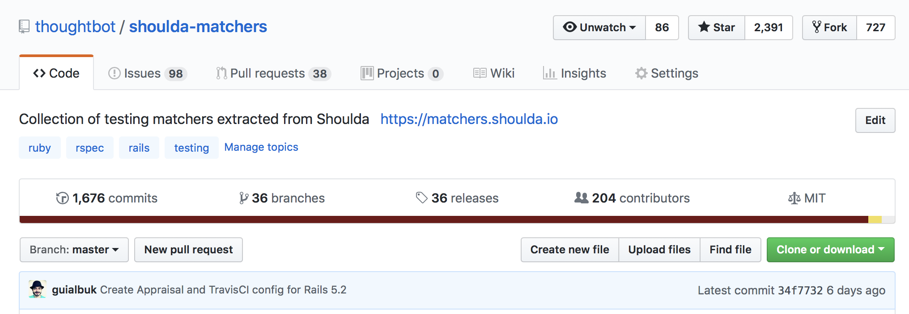

# Maintaining Open Source

## or how I learned to stop worrying and love dealing with grumpy people

---

# Hi, I'm Nick

^ I’m a developer at thoughtbot. We’re a consultancy that works with a
broadrange of clients, some small, some quite large (like who I’m working
with at the moment!).

^ We’re mostly known for a mix of our blog, Giant Robots, and our open source
work. For the past couple of years, I’ve taken over maintaining a couple of
those open source projects and that’s what I spend nearly all of my non-client
work time on.

---

## Investment Days

^ By “non-client time”, I mean investment days. We have a day a week, typically
Fridays, in which to work on projects which invest in ourselves, the company or
the community as a whole. As a 15 year-old company, this hasn’t always been the
case; back when we’d started a lot of our early open source efforts it was
mostly between projects and in evenings or weekends.

---


^ I maintain a few popular Ruby gems. `administrate`, which is a non-domain
specific language approach to building an admin interface in a Rails app. 

---



^ ... `shoulda` which makes writing some forms of tests more concise...

---


^ ...and `appraisal` which makes it easier to test against different
dependency versions in Ruby.

^ Both `administrate` and `shoulda` are often used on internal Rails projects
and we don’t really know how it’s being used or by how much. But, I often
see `appraisal` on other open source projects I come across.

^ As a maintainer, I think I’m pretty bad at it, but somehow people keep using
all of them. If you opened an issue, or contributed a PR in the last month or
so, I’ve likely still not seen it.  It’s a bit like my email inbox…

---

# A Brief History of Open Source

^ But before we go into that, let’s talk about what I mean by “open source”. 

^ Nearly all, if not actually _all_ software is built on a foundation of
freely available code that’s written by and maintained by communities of
people all around the world.

---


^ When we think about “open source” now, we probably think of GitHub with
it’s issues, pull requests, forking and so on. But for a long time this wasn’t
the centre of everything. Projects have been built around mailing lists,
forums, blogs and just email.

---

```
From 13c6409b6977a681aae45d784c2e835b06701c1b Mon Sep 17 00:00:00 2001
From: Nick Charlton <nick@nickcharlton.net>
Date: Mon, 6 Aug 2018 19:16:01 +0100
Subject: [PATCH 1/5] Return a 404 when docs pages are not found. (#1177)

Safari, at least, always tries to load a `apple-touch-icon.png` which
`DocumentationController` tries to find and render as markdown. This
leads to the prototype app having a lot of odd errors.
---
 .../app/controllers/docs_controller.rb        | 27 +++++++++++++++----
  spec/features/documentation_spec.rb           |  6 +++++
   2 files changed, 28 insertions(+), 5 deletions(-)

   diff --git a/spec/example_app/app/controllers/docs_controller.rb 
   b/spec/example_app/app/controllers/docs_controller.rb
   index 820abc8..dece841 100644
   --- a/spec/example_app/app/controllers/docs_controller.rb
   +++ b/spec/example_app/app/controllers/docs_controller.rb
   @@ -5,19 +5,36 @@ class DocsController < ApplicationController
      }.freeze
```

^ The OpenBSD project survives pretty well on sending patches back and forth
over email, for example.

---

### [fit] :money_with_wings: :information_desk_person: :construction_worker:

^ Some of these people are paid to do so (either directly, or as part of their
usual job), but the vast majority do so in their own free time. Most of us who
use Open Source software just use it as is: many libraries we use without
thinking of contributing back, often because we never need anything extra from
it. 

^ I’ve been doing this a lot lately on my current client project: we’re
building an Electron app, with React, some Node.js and others and so far I’ve
not needed to contribute to the upstream projects.

^ People maintain or contribute to open source software for various reasons.
Sometimes it’s marketing, sometimes it’s a company built around a project,
some times it’s just fun to collaborate with people asynchronously all over
the world.

^ Overall though, the more people that contribute to open source software,
the more open source software gets better and so do those contributing to
open source,

^ As someone who’s contributed to several projects, I’ve seen lots of
different ways of approaching problems, this exposure has made me a better
software developer.

---

# Taking over maintaining a project

^ Of most of the projects I now maintain, I didn’t start them. Of the projects
I have started, they’ve mostly helped just me and a handful of other people.
I’ve written a few API clients, maintained my `dotfiles` for nearly a decade
at this point and so on.

^ So, whilst I can’t tell you much about how to make projects popular, that’s
not where much of the labour in open source really is. It’s mostly in keeping
projects going. Reviewing pull requests, replying to issues, setting the 
direction and building a community.

^ All I do know is that popularity is some vague combination of luck and
timing. And you really can’t predict when either is going to happen.

---

# Taking over maintaining a project

^ But once you have users, that’s where the real work starts. I got started
with `administrate` after getting annoyed by some grumpy comments left on an
issue thread.

^ It was something along the lines of: “is this still maintained?” at the
light end, to implying some form of hostile neglect on the other. In practice,
the original maintainer had just moved jobs …in this case to the US form of GDS.

^ Others had tried too, but somehow my efforts stuck compared to those and I
got into it much more deeply than other’s had been able to.

---

# Taking over maintaining a project

^ I started by closing off old and invalid issues. Then old and invalid pull
requests. There was some low-hanging fruit — small documentation changes,
internationalisation fixes, some pull requests where someone had done a great
job on fixing a Rails version incompatibility and so on.

^ Then began some of the harder work. What should fit in the next release?
When should the next release be? What should we focus on documenting? What
can we break? How will I find time to sit through and review this PR properly?

^ Now — some two years later — I’m still pretty much doing all of the same
thing.

---

# Taking over maintaining a project

^ `administrate` is, almost by definition, a broad project. As a user you add
it to your existing Rails application, then use the generators to build
dashboards for your models. It tries to avoid as much magic as it can whilst
still being helpful.

^ You should be able to override bits of dashboards as with any other Rails
controller, because fundamentally that’s what they are.

---

# Looking at project health

^ Over those past two years, I’ve begun to get interested in and think a lot
about what a healthy open source project looks like.

^ I think there’s two angles to this. One is from a user’s standpoint, and
the other from a maintainer’s. They don’t sit opposed to each other, they’re
just different metrics by which we can track things.

---

| users/contributors | maintainers |
| --- | --- | --- |
| feel welcome to open issues | people contributing changes |
| have their PRs reviewed in a friendly and timely manner | people chipping in with other open issues |
| a regular release cadence | few regressions |

---

# [fit] :clock12: :pager: :sweat: :put_litter_in_its_place: :ambulance:

^ Additionally, as a maintainer you will feel a certain obligation to your
users and contributors, sometimes this feeling is at odds with the rest of
your life and if you don’t feel like you can step away, you are very likely to 
overwork to keep up with everything. If you’re not careful this can lead to
maintainer burnout.

---

# [fit] :chart_with_upwards_trend: :scroll: :bow:

^ Fortunately, there’s some documented methodologies for measuring project
health. Nadia Eghbal has written about this extensively.

^ an “ideal” (issue zero/pr zero which peaks and closes regularly)

---

# Painful things with maintaining projects

^ I previously mentioned our investment time as how I spend time working on
open source. Unfortunately, it’s never quite that simple.

^ In practice, there’s always other bits I need to do on a Friday. Be it team
retros, interviewing, other things I might wish to look at, etc. So I might
end up with perhaps a morning a week of time to really spend. This means that
you always look at things at other times: usually an evening or two a week.

^ I've heard of organisations doing various things similar to us, but also
specifically allocating time to ensure they're contributing back, too.

---

## Expectations

^ These time constraints are made worse by other expectations, imagined or real.

^ I find the expectations are most strong around new Rails releases:
inevitably something will be slightly broken, or now have a deprecation
warning and we’ll need to fix it and cut a new release.

---

> Then, don’t get your hopes up! Unless you have a “Code Red, Mission Critical,
> the World is Coming to an End” kind of bug, you’re creating this issue report
> in the hope that others with the same problem will be able to collaborate
> with you on solving it. Do not expect that the issue report will
> automatically see any activity or that others will jump to fix it. Creating
> an issue like this is mostly to help yourself start on the path of fixing the
> problem and for others to confirm it with an “I’m having this problem too”
> comment. - [Rails contribution guide][].

[Rails contribution guide]: https://guides.rubyonrails.org/contributing_to_ruby_on_rails.html


^ Something about large companies taking liberties

---

## Unseen Infrastructure

^ OpenSSL is the most prominent example of this. In this case, some significant
security issues were found in the project (heartbleed). We discovered that at
that point in time it had just the one full time maintainer …and let’s say
that the `C` it’s written in is not the easiest to understand.

^ This provided a great example of the unseen infrastructure that we’re all
reliant on. Your phone includes OpenSSL, so does Ruby, Python and Node.js.
Unless you’ve had to make an SSL certificate, you’ve probably not considered
it’s existence, much less it’s pervasiveness. I certainly hadn’t.

^ This is a common trend across technology as a whole. Indeed, it’s a
quintessential example of the “tragedy of the commons”. We’re all at some
point a free-rider. We’re using resources shared among everyone, but rarely
contributing back. There’s always someone who will, right? 

---

# Joyful things with maintaining projects

^ But I don't want to be too much of a downer. Maintaining some of these
projects has been some of the most rewarding work I've done.

^ There's nothing like getting a first-time contributors' PR merged, only
having them come back in the future with something new.

^ Some of that has been in internationalisation PRs: talk about Ukrainian one

---


^ And sometimes people tweet nice things, too.

---

# How to make things better

---

## Octobox


---

## Issue Templates


^ Ask for demo apps which show off an issue

---

## Probot


^ A bot which auto-closes stale issues

---

## Make it easier to run

^ CI

^ Heroku Review Apps on administrate: it's a website as much as a library

---

## Always be closing

^ As we discussed earlier, a healthy project is one which has frequent
resolutions. Those resolutions don't have to be successful merges: saying no
is important too.

---


[https://twitter.com/solomonstre/status/715277134978113536](https://twitter.com/solomonstre/status/715277134978113536)

^ Part of this is closing issues or PRs where it doesn't fit the vision for
the project. Perhaps that might change in the future, and that's okay too.

^ Jessie Frazzelle has a great post on this where she talks about ways to
close issues: ego stoke and close, close early, push to try again, taking over
their patch.

---

## Building Communities


^ Contributors as a sales funnel

^ First time issues: They might cause more “drive-by” contributions than
encourage deeper contributions, and more importantly take away the interesting
part of solving a problem: figuring it out, breaking it down _then_ writing
the code.

^ Open Open Source

---

## Funding Open Source

---

### The Community Compact

^ Last month, Adam Jacob, the CTO of the company behind Chef (a configuration
management tool) described a new sort of license called The Community Compact.

^ The purpose is to push for a better relationship between companies trying to
make money from software and the, sometimes opposing, groups contributing
changes.

^ The concept centres around founding a business to contain the project
itself. Subsequently different licenses can be sold for consultancies, hosted
services or those requiring a support contract. The idea here being that
someone building a consulting business around a technology would contribute
back, either financially, with code contributions or perhaps both.

^ I think this is quite an interesting concept. It acknowledges that,
fundamentally we’re a community of people building something and uses social
pressure to try to enforce compliance. This is a social contract that we’re
all familiar with, be it at an event’s code of conduct or how we behave when
we’re in the pub.

---

### License Zero

^ A slightly older concept is Licence Zero. It describes a derivative version
of the BSD license (one of those most permissive open source licenses) which
includes a clause on payment on for-profit use.

^ Someone using a project for-profit would have 90-days to use it before
committing to paying for a commercial license. The idea here is that another
open source project would still be able to use it, but someone making money
from the use would not.

---

### Open Source Core

^ Perhaps the most common model for funding open source is the idea of an
“open source core”. This is the case for Nginx, Elasticsearch and Redis.

^ Unfortunately, in this case incentives aren’t necessarily aligned. To force
an organisation to pay up, the firm behind the project might have to
artificially restrict features or extract otherwise necessary functionality to
make the business sustainable.

---

### Alternative Models

^ Patreon, Open Collective, Tidelift

---

# Resources

* [Nadia Eghbal: Methodologies for measuring project health](https://nadiaeghbal.com/project-health)
* [Ford Foundation Report: Roads and Bridges: The Unseen Labor Behind Our Digital Infrastructure](https://www.fordfoundation.org/about/library/reports-and-studies/roads-and-bridges-the-unseen-labor-behind-our-digital-infrastructure/)
* [Jessie Frazelle: The Art of Closing](https://blog.jessfraz.com/post/the-art-of-closing/)
* [Mike McQuaid: Open Source Maintainers Owe You Nothing](https://mikemcquaid.com/2018/03/19/open-source-maintainers-owe-you-nothing/)
* [Mike McQuaid: Robot Pedantry, Human Empathy](https://mikemcquaid.com/2018/06/05/robot-pedantry-human-empathy/)
* [Mike McQuaid: How To (Not) Fail At Using Open Source Software In Your Organisation](https://mikemcquaid.com/2018/09/04/how-to-not-fail-at-using-open-source-software-in-your-organisation/)

---

## Tools

* [Octobox](https://octobox.io)
* [GitHub: Issue Templates](https://blog.github.com/2016-02-17-issue-and-pull-request-templates/)
* [Probot: Stale](https://probot.github.io/apps/stale/)

---

# Any questions?

@nickcharlton

https://nickcharlton.net

https://thoughtbot.com/london

tbot.io/oss-talk-feedback
